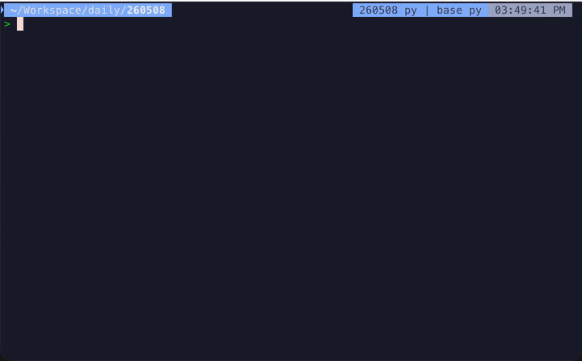

# agent-sh

A real shell with an AI agent one keystroke away.

[](https://www.npmjs.com/package/agent-sh)
[](https://github.com/guanyilun/agent-sh/blob/main/LICENSE)



I live in my terminal. A lot of the time I'm not coding — I'm deploying something, poking at a failing `rsync`, figuring out why `docker build` won't start, fixing a one-liner. And very often I need an AI agent to help. Spinning up a full coding agent for this stuff is overkill, and I got tired of copy-pasting errors into a chat window every time.

So I built agent-sh. Under the hood it's a normal shell on top of node-pty — your rc config, your aliases, vim and tmux all just work. But at the start of any line, type `>` and you're talking to a small agent that already sees your cwd, your last command, and its output. Nothing to set up, no project to explain.

```
~ $ ls -la                       # real shell command
~ $ cd ../tests && npm test      # real cd, env, aliases — all just work
~ $ vim file.ts                  # opens vim in the same PTY
~ $ > explain the last error     # agent investigates using its own tools
~ $ > draft a commit message     # agent reads your diff and shell history
```

agent-sh is built to be agent-agnostic. You can [bring your own coding agent](#bring-your-own-agent) or use the built-in agent `ash` — a lightweight, extensible agent if you'd like to build extensions on top of it.

## Quick Start

### Installation

Install from npm:

```bash
npm install -g agent-sh
```

Re-run the same command to update. Patch releases ship frequently; `npm update -g agent-sh` works too.

For unreleased changes on `main`, clone and link locally — this avoids `npm install -g github:...`, which builds on your machine and requires a working TypeScript toolchain:

```bash
git clone https://github.com/guanyilun/agent-sh.git
cd agent-sh
npm install        # installs devDependencies (typescript, etc.)
npm run build      # produces dist/
npm link           # exposes `agent-sh` globally
```

Requires Node.js 18+. Currently supports **bash** and **zsh**; other shells (fish, nushell, etc.) are not yet wired up.

**Windows:** the interactive shell layer is bash/zsh-only. Run agent-sh inside **WSL** for the full experience. Native Windows (cmd.exe / PowerShell) is not supported as the host shell, though headless / library / ACP-bridge usage may work — file an issue if you hit a gap.

Tip — add a shell alias:

```bash
alias ash="agent-sh"
```

Once installed, pick a backend below.

### Option A: Bring your own coding agent

If you already use a coding agent, host it inside agent-sh — same terminal, same `>` entry point, same shell-context wiring. Three bridges ship in the box:

- **pi** — [pi-mono](https://github.com/badlogic/pi-mono) coding agent
- **claude-code** — official [Claude Agent SDK](https://www.npmjs.com/package/@anthropic-ai/claude-agent-sdk)
- **opencode** — [opencode](https://opencode.ai/) via `@opencode-ai/sdk`

```bash
agent-sh install pi-bridge
agent-sh --backend pi
```

See [Bring your own agent](#bring-your-own-agent) below for full details and the other backends.

### Option B: Use the built-in agent (ash)

`ash` is agent-sh's own lightweight agent. It works with any OpenAI-compatible API — pick one of the zero-config paths below, no settings file needed. agent-sh auto-activates a built-in provider when it sees a known key.

**Hosted models via OpenRouter** (300+ models, one key):

```bash
export OPENROUTER_API_KEY=sk-or-...
agent-sh
```

**OpenAI:**

```bash
export OPENAI_API_KEY=sk-...
agent-sh
```

**DeepSeek:**

```bash
export DEEPSEEK_API_KEY=sk-...
agent-sh
```

**Local models** (Ollama, llama.cpp server, LM Studio, vLLM — anything OpenAI-compatible):

```bash
export OPENAI_BASE_URL=http://localhost:11434/v1    # point at your server
agent-sh
```

Set `OPENAI_API_KEY` too if your server requires auth.

Once running, switch models at any time with `/model <name>` (tab-completes; selection persists across sessions).

For richer configuration (multiple providers, extensions), run `agent-sh init` to scaffold `~/.agent-sh/settings.json` with copy-pasteable examples. See the [Usage Guide](docs/usage.md) for the full list of supported providers.

`ash` is designed to be extended. Extensions can add tools, content transforms (e.g. render LaTeX or Mermaid), themes, slash commands, or new input modes — see [Extensions](docs/extensions.md) for the full surface.

## Bring your own agent

The built-in agent (`ash`) is the default, but agent-sh can host a different coding agent as its backend — same terminal, same `>` entry point, same shell-context wiring. Three bridges ship in the box:

- **[pi-bridge](examples/extensions/pi-bridge/)** — runs [pi](https://github.com/badlogic/pi-mono) (`@mariozechner/pi-coding-agent`) in-process. Pi brings its own models, tools, and `~/.pi/agent/settings.json`.

  ```bash
  agent-sh install pi-bridge
  agent-sh --backend pi
  ```

- **[claude-code-bridge](examples/extensions/claude-code-bridge/)** — runs claude-code (the official [Claude Agent SDK](https://www.npmjs.com/package/@anthropic-ai/claude-agent-sdk)) in-process. Uses claude-code's own `Read`/`Edit`/`Write`/`Bash`/`Glob`/`Grep` tools.

  ```bash
  agent-sh install claude-code-bridge
  agent-sh --backend claude-code
  ```

- **[opencode-bridge](examples/extensions/opencode-bridge/)** — runs [opencode](https://opencode.ai/) in-process via `@opencode-ai/sdk`. Uses opencode's tools, models, and `opencode auth login` credentials.

  ```bash
  agent-sh install opencode-bridge
  agent-sh --backend opencode
  ```

All three bridges receive agent-sh's per-query shell context (`<shell_events>`) and follow the PTY-tracked cwd, so the hosted agent sees what you ran and where you are. Switching at runtime with `/backend <name>` persists the choice across sessions automatically; the `--backend` flag above is per-session only.

**Caveat:** pi, claude-code, and opencode each manage their own tool surfaces, so agent-sh extensions that register tools (or skills, instructions, etc.) for the built-in `ash` agent generally won't be visible to a hosted backend. Frontend extensions (themes, content transforms, slash commands, the TUI renderer) keep working — only the agent-side capabilities differ. Use the bridges when you want that agent's toolset; stay on `ash` when you want agent-sh's extension ecosystem.

## Key Features

**Real terminal, zero compromise.** Full PTY with your shell config, aliases, and environment. Shell starts instantly — the agent connects asynchronously in the background.

**One entry point, smart tool selection.** Type `>` and agent-sh figures out how to help. Scratchpad tools (`bash`, `read_file`, `grep`, `glob`) for investigation. Extensions add capabilities like running commands in your live shell. No modes to pick — the agent reasons about which tools to use based on your intent.

**Context that just works.** Every query includes your cwd, recent commands, and their output. Run a failing test, type `> fix this`, and agent-sh knows exactly what happened. Context management works like shell history — continuous, persistent across restarts, no sessions to manage. See [Context Management](docs/context-management.md).

**Any LLM, any backend.** agent-sh works with any OpenAI-compatible API out of the box. Define multiple providers in settings and switch models at runtime with `/model <name>`. Or swap in a completely different agent — bundled bridges run [pi](examples/extensions/pi-bridge/), [claude-code](examples/extensions/claude-code-bridge/), or [opencode](examples/extensions/opencode-bridge/) as a drop-in backend (see [Bring your own agent](#bring-your-own-agent)).

**Extensible by design.** The entire system is built on a typed event bus. Extensions can add custom input modes, content transforms (render LaTeX as images, Mermaid as diagrams), themes, slash commands, or replace the agent backend entirely. The built-in TUI renderer is itself just an extension.

**Embeddable as a library.** The core is a headless kernel — `import { createCore } from "agent-sh"` to build WebSocket servers, REST APIs, Electron apps, or test harnesses. No terminal required.

## Documentation

Start with **Usage** to get running, then **Architecture** for the mental model.

1. [Usage Guide](docs/usage.md) — install, run, configure providers and models
2. [Architecture](docs/architecture.md) — pure kernel + extensions, the shell ↔ agent boundary
3. [The Built-in Agent: ash](docs/agent.md) — query flow, tools, system prompt, model switching
4. [Context Management](docs/context-management.md) — shell-output spill, three-tier conversation compaction, recall APIs
5. [Extensions](docs/extensions.md) — event bus, content transforms, custom agent backends, theming
6. [TUI Composition](docs/tui-composition.md) — compositor, render surfaces, stream routing
7. [Library Usage](docs/library.md) — embedding agent-sh in your own apps
8. [Troubleshooting](docs/troubleshooting.md) — common errors and debug mode

## Development

```bash
git clone https://github.com/guanyilun/agent-sh.git
cd agent-sh
npm install
npm run build
npm start
```

## License

MIT
